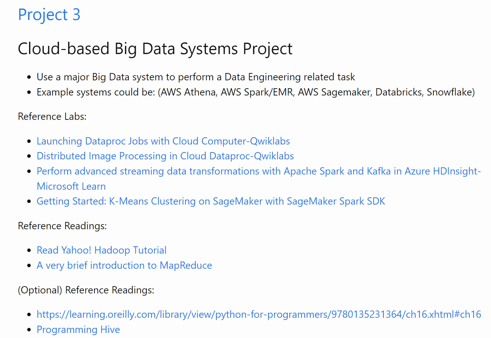

# IDS-721-03-Data

## Intro
In the project, we are going to use a major Big Data system to perform a Data related task, 
and applied our system on AWS Athena, AWS Spark/EMR, AWS Sagemaker, Databricks, Snowflake.
In this project, I used Rust to calculate average year experience a job need. 

## Set Up
1. set virtual enviroment
```
python3 -m venv env
source env/bin/activate
```
2. install
```
curl --proto '=https' --tlsv1.2 -sSf https://sh.rustup.rs | sh
source "$HOME/.cargo/env"
```
3. create project
```
cargo new src
```
add following to depandent 
```
csv = "1.1.6"
```
4. check code error
```
make format
make lint
```
## Project Present


## Requirements
