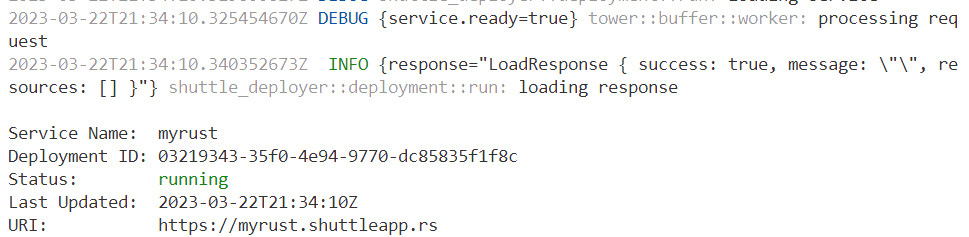

# IDS-721-03-Serverless

## Intro
In this project, we are going to deploy a serverless data enginneering pipelines using Rust. 
In this project, I used Rust to calculate average year experience a job need from a cvs file.
Shuttle.rs can simplyfy the deployment process of Rust applications to AWS Lambda by uploading the file of shuttle pipeline.

## Set Up
1. set virtual enviroment
```
python3 -m venv env
source env/bin/activate
```
2. install
```
curl --proto '=https' --tlsv1.2 -sSf https://sh.rustup.rs | sh
source "$HOME/.cargo/env"
```
3. create project
```
cargo new proj
```
add following to depandent 
```
csv = "1.1.6"
```
4. check code error
```
make format
make lint
```
5. cargo shuttle
install: run the command to install shuttle, when install the shuttle, we may need to install the "3.15.8" version of protoc and "0.12.0" version of cargo-shuttle
```
cargo install cargo-shuttle
```
login: run the command to start the login process
```
cargo shuttle login
```
authenticate: run the command to authenticate
```
cargo shuttle login --api-key MDs3nfGTVNfZuqWw
```
initialize: run the command to initialize your project
```
cargo shuttle init
```
deploy: run the command to deploy the project
```
cargo shuttle deploy
```
If the code is existed, use the following code to new a project
```
cargo shuttle project new
```


## Deploy locally

use the command to run 

```
cargo shuttle run   
```

This is main page, shows the title of the project.

If add "/CEO", we can get the average year experience of CEO. 

If add "/CFO", we can get the average year experience of CFO.


## Deploy via shuttle
1. deploy the project
```
cargo shuttle deploy --allow-dirty
```

2. service is available at {crate_name}.shuttleapp.rs. 
For my code, my service is: https://myrust.shuttleapp.rs


3. run the service


4. upload file to aws lambda
I connect my codespace with aws, then upload the file to lambda, and we can also test our project on AWS lamdba.


## Reference
https://grpc.io/docs/protoc-installation/
